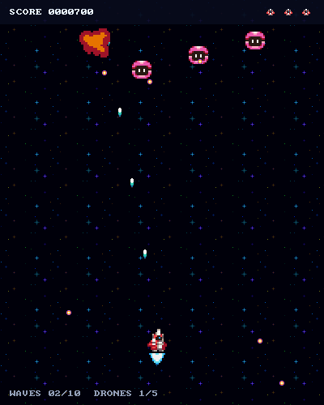

# Gnarlaxx

A small vertical shoot 'em up for learning how **C, Odin, and Zig** express the
same game. The focus is the interaction between graphics, audio, input, and
gameplay, and the concrete tradeoffs that appear in each implementation.

One mission, three enemy types, a multipart boss, music and effects, pause, and
local high scores. Keep it simple: this is a learning experiment, with functional
retro art and room to cut corners.

## Current state

The **C, Odin and Zig versions are playable on macOS**, using Sokol for graphics, input,
and audio. All include the full mission, boss phases, menus, pause, volume
controls, and saved high scores. Audio decoding/mixing/output is now a small
[local C library](libs/audio/README.md) used by all three implementations.
The tag `c-original-reference` preserves the verified C implementation of the
original task, including its fixed game arrays. Current C uses dynamic collections
with explicit ownership, allocation failure, replay, and cleanup, and is the
comparison baseline for Odin and Zig. Both ports use their own dynamic collections,
tagged events, rendering commands and score handling. Zig is ready for user
playtesting; walkthroughs and the language comparison are the next milestone.

Build the C version on macOS with Xcode command-line tools and CMake:

```sh
cmake -S . -B build -DCMAKE_BUILD_TYPE=Release
cmake --build build -j
./build/gnarlaxx
```

Build Odin with an installed Odin compiler, Python 3 and the same native tools:

```sh
python3 tools/build_odin.py
./build/odin/release/gnarlaxx
```

See the [Odin build and test notes](implementations/odin/README.md), including the
local LLVM workaround for the development machine's older Homebrew compiler.

Build Zig with Zig 0.17.0, Python 3 and the same native tools:

```sh
python3 tools/build_zig.py --test
./build/zig/release/bin/gnarlaxx
```

See the [Zig build notes](implementations/zig/README.md) for direct `zig build`
commands and the project-local compiler setup used on the development machine.

Dependencies are [vendored and pinned](vendor/README.md); no network access or
asset-generation tools are required to build or run.

The image below is captured from the running C version's 400 × 500 render target.



## Play

| Action | Keys |
| --- | --- |
| Move / navigate menus | WASD or arrow keys |
| Fire | Hold Space |
| Select / replay | Enter |
| Pause / resume / back | Escape |
| Sound controls | V; arrows adjust master, music, or effects |
| Leave a paused run | Q |

The game also pauses when the window loses focus. Clear ten waves and five
drones, then destroy the boss's two gun holders before attacking its core.
Each boss part takes ten hits. You have three lives and brief invulnerability
after a hit.

High scores are stored in `~/Library/Application Support/Gnarlaxx/scores.txt`.
Volume settings last for the current session. See the [C](implementations/c/README.md)
[Odin](implementations/odin/README.md), and [Zig](implementations/zig/README.md)
build notes for path overrides, diagnostics, and testing instructions. All versions
use the same high-score file format.

## Inspect the assets

Clone the repository and open `assets/preview.html` in a browser. It works
locally without a server and includes images and audio controls. On macOS:

```sh
git clone https://github.com/framkant/gnarlaxx.git
cd gnarlaxx
open assets/preview.html
```

The package includes a sprite atlas with named rectangles, a bitmap font, title
and level-clear lettering, a music track, eight sound effects, and two robotic
voice lines. See [asset documentation and credits](assets/README.md) for formats,
sources, and optional regeneration instructions. The prepared files are checked
in; game builds do not need the asset-generation tools.

## Work trail

- [Plan and milestones](plan.md)
- [Numbered development journal](docs/journal/README.md)
- [Shared asset manifest](assets/manifest.json)

The journal records decisions, work performed, checks, and remaining questions
at meaningful checkpoints. The implementations will use shared assets and
behavior while keeping each language's code idiomatic.

## License

Original project code, documentation, and project-created asset additions are
available under the [MIT License](LICENSE). Third-party assets retain their
existing licenses: the downloaded art, music, and effects are CC0, and the bitmap
font is public domain. See [asset credits](assets/README.md) and the retained
notices in [assets/licenses](assets/licenses).
