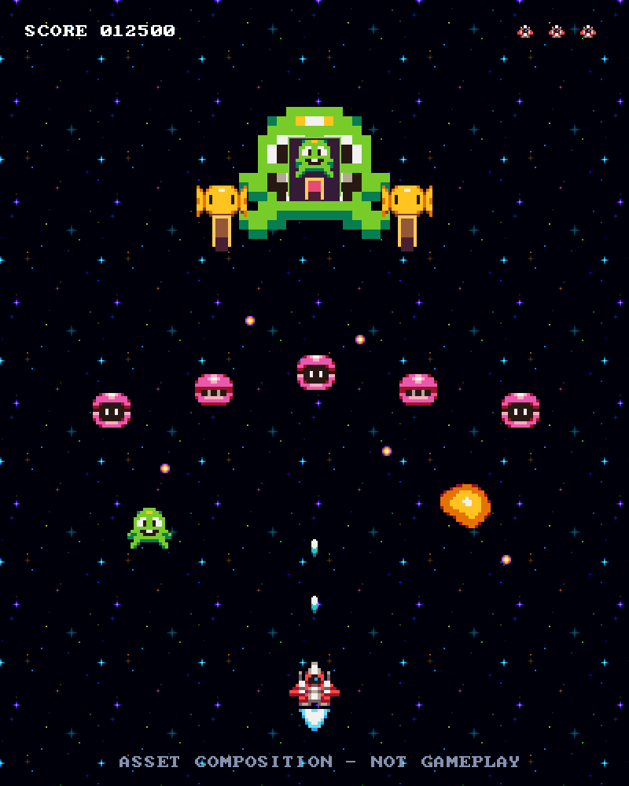

# Gnarlaxx

A small vertical shoot 'em up for learning how **C, Odin, and Zig** express the
same game. The focus is the interaction between graphics, audio, input, and
gameplay, and the concrete tradeoffs that appear in each implementation.

One mission, three enemy types, a multipart boss, music and effects, pause, and
local high scores. Keep it simple: this is a learning experiment, with functional
retro art and room to cut corners.

## Current state

The [plan](plan.md) is agreed and the shared asset package is prepared. There is
no playable game yet. Next is a minimal native C application using Sokol where
practical, with miniaudio available if needed for audio. Odin and Zig follow the
playable reference; code walkthroughs and the comparison come afterward.

The image below is an asset composition at the planned 400 × 500 resolution,
not a screenshot of a running implementation.



## Inspect the assets

Clone the repository and open `assets/preview.html` in a browser. It works
locally without a server and includes images and audio controls. On macOS:

```sh
git clone https://github.com/framkant/gnarlaxx.git
cd gnarlaxx
open assets/preview.html
```

The package includes a sprite atlas with named rectangles, a bitmap font, title
and level-clear lettering, a music track, eight sound effects, and two robotic
voice lines. See [asset documentation and credits](assets/README.md) for formats,
sources, and optional regeneration instructions. The prepared files are checked
in; the eventual game builds will not need the asset-generation tools.

## Work trail

- [Plan and milestones](plan.md)
- [Numbered development journal](docs/journal/README.md)
- [Shared asset manifest](assets/manifest.json)

The journal records decisions, work performed, checks, and remaining questions
at meaningful checkpoints. The implementations will use shared assets and
behavior while keeping each language's code idiomatic.

## License

Original project code, documentation, and project-created asset additions are
available under the [MIT License](LICENSE). Third-party assets retain their
existing licenses: the downloaded art, music, and effects are CC0, and the bitmap
font is public domain. See [asset credits](assets/README.md) and the retained
notices in [assets/licenses](assets/licenses).
